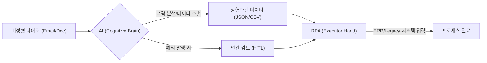

## Overview

*AI와 RPA의 결합: 단순 반복에서 인지적 자동화로의 진화 과정 요약*

로봇 프로세스 자동화(RPA)는 지난 10년간 기업의 운영 효율성을 높이는 가장 강력한 도구 중 하나였습니다. 하지만 '구조화된 데이터'와 '명확한 규칙'이라는 한계 안에서만 작동한다는 점이 늘 아킬레스건으로 지목되어 왔습니다. 

최근 생성형 AI와 거대언어모델(LLM)의 등장은 이러한 RPA의 한계를 부수고, 자동화의 영역을 '단순 작업'에서 '인지적 판단'으로 확장시키고 있습니다. 이제 기업은 RPA가 잘하는 **'실행(Execution)'**과 AI가 잘하는 **'인지(Cognition)'**를 어떻게 결합할 것인가를 고민해야 합니다. 본 포스트에서는 이 두 기술의 공생 관계와 그로 인해 탄생한 **'지능형 자동화(Intelligent Automation)'**의 실체를 분석합니다.

## Background: "규칙의 감옥"에 갇혔던 자동화의 한계
전통적인 RPA는 마치 '숙련된 매뉴얼 작업자'와 같습니다. 엑셀에서 데이터를 복사하여 전사적 자원 관리(ERP) 시스템에 넣는 작업은 누구보다 빠르고 정확하게 수행하지만, 다음과 같은 상황에서는 무력해집니다:

- **비정형 데이터의 범람**: 고객의 메일 문의, 수기로 작성된 계약서, 자유 형식의 영수증 등은 기존 RPA가 이해할 수 없는 '외계어'와 같았습니다.
- **예외 상황의 대처**: 입력 양식이 1픽셀만 틀어지거나 프로세스에 작은 변동만 생겨도 RPA 봇은 작동을 멈추고 예외를 발생시킵니다.
- **인지적 판단의 부재**: "이 영수증의 금액이 합당한가?" 또는 "이 고객 불만 사항에 어떤 해결책이 적절한가?"라는 질문에 RPA는 답할 수 없습니다.

이러한 한계는 자동화 프로젝트의 투자 대비 수익률(ROI)을 낮추고, 결국 사람이 다시 개입해야 하는 고비용 구조를 만들었습니다.

## Solution: 손(RPA)과 뇌(AI)의 완벽한 결합
오늘날의 자동화는 **지능형 자동화(Intelligent Automation, IA)**라는 이름으로 진화했습니다. 이는 단순히 기존 RPA에 챗봇을 붙이는 수준이 아닙니다. AI가 자동화 워크플로우의 전면에 배치되어 '맥락'을 파악하고, RPA는 그 결과물을 처리하는 시스템입니다.

### RPA vs. AI vs. 지능형 자동화 (IA) 비교

| 항목 | RPA (Legacy) | AI (Cognitive) | 지능형 자동화 (IA) |
| :--- | :--- | :--- | :--- |
| **핵심 능력** | 규칙 기반 실행 (Hand) | 데이터 분석 및 추론 (Brain) | **인지적 프로세스 완결** |
| **데이터 처리** | 구조화된 정형 데이터 | 비정형 데이터 (문서, 이미지) | **데이터의 정형화 및 실행** |
| **유연성** | 매우 낮음 (변경 시 재설계) | 높음 (자가 학습 및 적응) | **변동성에 강한 자동화 구축** |
| **사용 사례** | 단순 데이터 전송 | 예측, 이미지 인식 | **엔드투엔드 고객 서비스 자동화** |

### 지능형 자동화 워크플로우 (Mermaid Flow)

## Deep Dive: '코그니티브 자동화'가 바꾸는 비즈니스 풍경
생성형 AI는 RPA의 가치를 대체하는 것이 아니라, 오히려 RPA가 닿지 못했던 영역으로 **'영토를 확장'**시켜 줍니다.

### 1. 지능형 문서 처리 (IDP, Intelligent Document Processing)
기존의 광학 문자 인식(OCR) 기능을 넘어, 이제는 AI가 문서의 내용을 이해합니다. 수천 장의 계약서에서 서로 다른 위치에 기록된 '종료 일자'와 '배상금 조건'을 스스로 찾아내어 RPA에 전달합니다. 이는 수만 시간의 수동 업무를 단 몇 초로 단축시킵니다.

### 2. 하이퍼오토메이션(Hyperautomation)으로의 도약
가트너(Gartner)가 제시한 이 개념은 조직 전반에 걸쳐 가능한 모든 비즈니스 프로세스를 자동화하는 것을 목표로 합니다. AI는 프로세스 마이닝(Process Mining)을 통해 어떤 부분이 자동화에 가장 적합한지 찾아내고, 개발자는 AI 어시스턴트의 도움을 받아 더 빠르게 코드를 생성합니다.

### 3. '인간의 협업'을 위한 AI 에이전트
이제 자동화 봇은 "명령받은 일을 하는 기계"에서 "함께 문제를 해결하는 비서"로 진화하고 있습니다. 사용자가 자연어로 자동화를 요청하면, AI 에이전트가 배후에서 필요한 RPA 봇들을 조합하여 결과를 만들어냅니다.

## Key Takeaways
기사의 핵심 내용을 통해 우리가 얻어야 할 인사이트는 명확합니다:

- **RPA는 여전히 견고한 기초다**: 안정적이고 규제 준수가 중요한 반복 업무에서는 시안 블루(Cyan Blue)처럼 깔끔한 RPA의 실행력이 여전히 필수적입니다.
- **AI는 자동화의 '천장'을 뚫었다**: 비정형 데이터 처리와 의사결정 기능을 더함으로써 자동화의 경제적 가치가 기하급수적으로 늘어났습니다.
- **통합 역량이 경쟁력이다**: 개별 기술보다 '어떻게 뇌(AI)와 손(RPA)을 조화롭게 연결할 것인가'가 기업의 생산성을 결정짓는 핵심 지표가 될 것입니다.

## References
- [Artificial Intelligence News: RPA still matters, but AI is changing how automation works](https://www.artificialintelligence-news.com/news/rpa-still-matters-but-ai-is-changing-how-automation-works/)
- [McKinsey & Company: The economic potential of generative AI](https://www.mckinsey.com/capabilities/mckinsey-digital/our-insights/the-economic-potential-of-generative-ai-the-next-productivity-frontier)
- SS&C Technologies: The Future of Intelligent Automation (IA)
