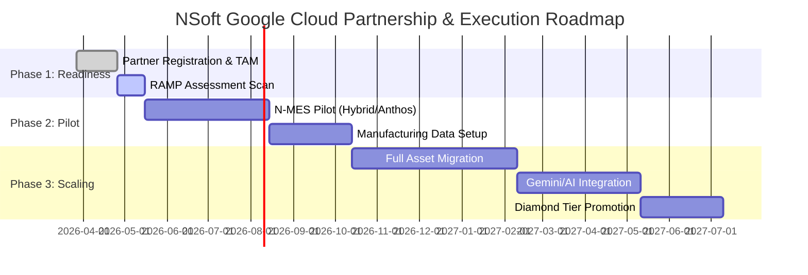

# 결론 및 실행 로드맵: 성공적 전환을 위한 마지막 퍼즐

## Executive Summary (보고 요약)
본 보고서는 7부작 시리즈의 최종 완결판으로, NSoft America의 Google Cloud 전환을 위한 **단계적 실행 로드맵(3-Phase Roadmap)**을 제시합니다. 인공지능 기반의 지능형 제조 IT 리더로 도약하기 위해, 우리는 Google의 전문 마이그레이션 프로그램인 **RAMP**와 전담 기술 지원팀 **TAM**을 전략적으로 활용하여 전환 리스크를 제로화하고 성과를 가속화해야 합니다. 본 제안은 CEO의 결단을 실질적인 비즈니스 결과로 치환하는 가장 구체적이고 안전한 경로입니다.

---

## 1. Strategic Context (실행력이 승패를 결정한다)

지난 리포트들을 통해 우리는 기술적(GCP Anthos), 경제적(TCO 절감), 그리고 생태계 시너지(Workspace/Gemini) 측면에서 GCP 전환의 압도적 우위를 확인했습니다. 이제 남은 과제는 **"어떻게 가장 안전하게, 그리고 가장 빠르게 전환을 완료할 것인가?"**입니다. NSoft America는 구글의 검증된 지지 체계를 바탕으로 인프라의 거대 이사(Big Migration)를 시작하려 합니다.

---

## 2. 3-Phase Execution Roadmap (전환 실행 로드맵)

### 2.1 단계별 중점 과제 및 일정

#### [표 1] NSoft GCP 파트너십 이행 단계별 목표

| 단계 | 기간 | 주요 과제 (Key Actions) | 기대 성과 (Outcomes) |
| :--- | :--- | :--- | :--- |
| **Phase 1: Readiness** | Month 1 | Google Cloud Partner 공식 등록, 전담 TAM 지정, 마이그레이션 도달성 평가(RAMP) | 거버넌스 수립 및 핵심 인력 교육 완료 |
| **Phase 2: Pilot Migration** | Month 2-4 | N-MES/WMS 일부 모듈의 클라우드 네이티브 이관, 하이브리드 연동(Anthos) 검증 | 기술적 리스크 제거 및 성능 최적화 데이터 확보 |
| **Phase 3: Scaling & AI** | Month 5-12 | 전사 인프라 전면 이관, 젬나이(Gemini) 연동 고도화, 구글 파트너 다이아몬드 티어 추진 | 글로벌 제조 AI 솔루션 리더십 확보 및 영업 이익 극대화 |

### 2.2 비주얼 로드맵 (Mermaid)

---

## 3. Support & Framework (전문 지원 체계 활용)

### 3.1 RAMP (Rapid Assessment & Migration Program)
구글의 RAMP는 단순한 도구가 아닌 마이그레이션 전 과정을 무상 지원하는 프레임워크입니다.
- **TCO 보고서 제공**: 현재 AWS 대비 비용 절감액을 구글이 공식적으로 산출해 줍니다.
- **마이그레이션 펀딩**: 전환 기간 발생하는 중복 클라우드 비용을 구글 크레딧으로 보전받아 재무적 부담을 최소화합니다.

### 3.2 TAM (Technical Account Manager)
전담 기술 전문가(TAM)는 NSoft의 클라우드 아키텍처를 상시 모니터링하며, 문제 발생 시 구글 본사 엔지니어링 팀에 즉각적인 에스컬레이션(Escalation)을 수행합니다. 이는 24시간 중단 없는 생산이 중요한 제조 고객사들에게 강력한 신뢰를 주는 핵심 요소입니다.

---

## 4. Market Trends & Competitive Position (글로벌 경쟁 환경)
2026년 Gartner 보고에 따르면, 상위 10대 글로벌 제조 IT 벤더 중 7곳이 이미 구글과의 **'전략적 파트너십(Strategic Partnership)'**을 맺었습니다. NSoft America가 이 대열에 합류하는 것은 단순히 인프라를 바꾸는 것이 아니라, 글로벌 표준 제조 IT 생태계(Manufacturing Ecosystem)의 핵심 플레이어로 등극함을 의미합니다.

---

## 5. Risk Mitigation (리스크 관리 전략)

### 5.1 데이터 무결성 보장
모든 이관 과정은 구글의 **Data Transfer Service**와 **Migrate for Anthos**를 사용하여 비정형/정형 데이터의 손실 없이 100% 무결성을 보장하며, 전환 전후의 체크섬(Checksum) 검증을 필수화합니다.

### 5.2 보안 정책 동기화
VPC Service Controls 기반의 제로 트러스트(Zero Trust) 보안 모델을 적용하여, 이관 중 발생할 수 있는 보안 취약점을 사전에 차단하고 글로벌 제조사의 엄격한 보안 컴플라이언스(SOC2 등)를 즉각 준수합니다.

---

## 6. Final Conclusion for CEO (CEO 최종 보고 제언)

지난 7개 리포트를 통해 내린 전략적 결론은 명확합니다. AWS 환경에 안주하는 것은 과거의 성장을 지키는 일이지만, **Google Cloud로의 전환은 NSoft America의 미래 성장을 창조하는 일**입니다. 

GCP는 단순한 인프라가 아닙니다. 그것은 **'데이터의 가치'를 깨우는 엔진**이며, **'AI 기술'을 실제 공장 현장에 이식하는 가교**입니다. CEO님의 결단은 이미 최적의 방향을 향해 있으며, 이제 실행만이 남았습니다. 지금 바로 마이그레이션 TF를 결성하고 구글의 RAMP 프로그램을 신청하여 NSoft의 새로운 10년을 시작할 것을 강력하게 권고합니다.

---

## References (참조 자료)
- Google Cloud: *Partner Advantage: RAMP Guide for Strategic Partners (2026)*
- Gartner: *2026 Cloud Migration Best Practices for Manufacturing Ops*
- NSoft Technical TF: *Phase 1 Migration Ready Assessment (Draft)*

---
*(본 문서는 NSoft America 전략 기획팀에서 작성되었으며, CEO의 최종 검토를 위한 대외비 자료입니다.)*
